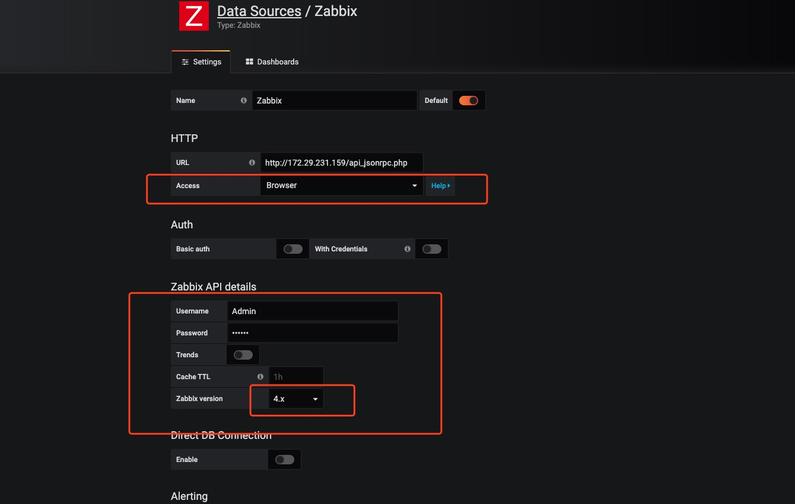

# 1.Zabbix 安装：  
使用官方zabbix 镜像库地址: https://github.com/zabbix/zabbix-docker 即可，然后分别执行以下命令：   

注意相应的地址ip 替换
```
- git checkout trunk

- docker-compose -f docker-compose_v3_alpine_mysql_latest.yaml pull

- docker-compose -f docker-compose_v3_alpine_mysql_latest.yaml up -d

- 找到 zabbix-agent 的 docker  ip 地址。然后返回去修改zabbix 里面的hosts 里面的对应 127.0.0.1

- 找到 zabbix-server 的 docker ip 地址。然后修改 .env_agent 里面 ZBX_SERVER_HOST 替换掉相应的 ip 地址。
然后重启zabbix-docker_zabbix-agent_1 镜像服务，服务正常启动完毕了
```

# 2.Zabbix-Agent 安装:  
进入agent 目录， 然后修改相应的ip 地址， 执行docker-compose up

# 3.Grafana 安装及插件配置：
- 直接拿官方loki 代码进来 https://github.com/long0419/loki ，然后执行下面命令下载zabbix 插件：
```
git clone https://github.com/alexanderzobnin/grafana-zabbix.git ./plugin
```
- 然后执行docker-compose up -d

